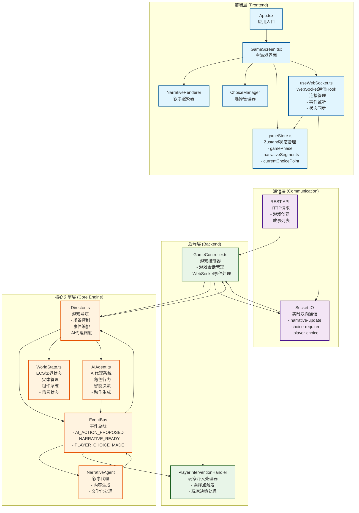

# 故事编织者 (StoryWeaver) 代码库简报文档

**版本：** v2.0.0
**更新时间：** 2025年7月29日
**文档类型：** 代码库简报 (Codebase Briefing Document)
**目标读者：** 开发者、AI助手、技术决策者

---

## 📋 文档概述

本文档是故事编织者项目的技术蓝图，旨在为任何开发者（包括AI助手）提供快速理解项目核心架构和实现逻辑的结构化指南。通过阅读本文档，您可以在5-10分钟内掌握整个项目的技术架构和实现细节。

## 🎯 项目核心理念

故事编织者是一个基于AI的互动叙事游戏，实现了"AI自主叙事与玩家关键决策相结合"的创新玩法。项目采用事件驱动架构，通过"编排器-代理"模式实现AI驱动的动态叙事生成。

**核心玩法闭环：**
```
AI自主叙事 → 关键节点 → 玩家介入 → 故事分支 → AI继续叙事
```

---

## 🏗️ 系统架构图



---

## 📁 项目文件结构树

```
故事编织者 (StoryWeaver) 项目结构
├── 📁 packages/                          # Monorepo工作空间
│   ├── 📁 core/                          # 🎮 核心游戏引擎 (95%完成)
│   │   ├── 📁 src/                       # TypeScript源码
│   │   │   ├── 📄 index.ts              # 核心引擎统一导出入口
│   │   │   ├── 📁 types/                # 类型定义集合
│   │   │   │   └── 📄 index.ts          # 核心数据结构类型
│   │   │   ├── 📁 world/                # ECS世界状态系统
│   │   │   │   └── 📄 WorldState.ts     # 实体组件系统管理器
│   │   │   ├── 📁 events/               # 事件驱动架构
│   │   │   │   └── 📄 EventBus.ts       # 全局事件总线
│   │   │   ├── 📁 director/             # 游戏流程控制
│   │   │   │   └── 📄 Director.ts       # 游戏导演 - 核心编排器
│   │   │   ├── 📁 agents/               # AI代理系统
│   │   │   │   ├── 📄 AIAgent.ts        # AI代理基础框架
│   │   │   │   ├── 📄 NarrativeAgent.ts # 叙事内容生成代理
│   │   │   │   └── 📄 StubAgentCore.ts  # AI接口存根实现
│   │   │   ├── 📁 handlers/             # 事件处理器
│   │   │   │   └── 📄 PlayerInterventionHandler.ts # 玩家介入处理
│   │   │   ├── 📁 services/             # 外部服务集成
│   │   │   │   ├── 📄 LLMService.ts     # LLM服务抽象层
│   │   │   │   └── 📁 adapters/         # 服务适配器
│   │   │   │       └── 📄 MockLLMAdapter.ts # Mock LLM适配器
│   │   │   ├── 📁 scenes/               # 场景管理
│   │   │   │   └── 📄 SceneLoader.ts    # 场景数据加载器
│   │   │   ├── 📁 interfaces/           # 接口定义
│   │   │   │   └── 📄 AgentCoreInterface.ts # AI核心接口规范
│   │   │   ├── 📁 config/               # 配置管理
│   │   │   │   ├── 📄 ConfigManager.ts  # 配置管理器
│   │   │   │   └── 📄 constants.ts      # 系统常量定义
│   │   │   └── 📁 utils/                # 工具函数
│   │   │       └── 📄 ErrorHandler.ts   # 错误处理机制
│   │   ├── 📁 dist/                     # TypeScript编译输出
│   │   ├── 📁 data/                     # 游戏数据文件
│   │   │   ├── 📁 scenes/               # 场景定义JSON
│   │   │   └── 📁 characters/           # 角色定义JSON
│   │   └── 📄 package.json              # 核心包配置
│   │
│   ├── 📁 api/                          # 🌐 后端API服务 (90%完成)
│   │   ├── 📁 src/                      # Express.js应用源码
│   │   │   ├── 📄 index.ts              # 服务器启动入口
│   │   │   ├── 📄 app.ts                # Express应用配置
│   │   │   ├── 📁 controllers/          # 控制器层
│   │   │   │   ├── 📄 GameController.ts # 游戏逻辑控制器
│   │   │   │   └── 📄 StoryController.ts # 故事管理控制器
│   │   │   ├── 📁 routes/               # 路由定义
│   │   │   │   ├── 📄 index.ts          # 路由汇总
│   │   │   │   ├── 📄 game.ts           # 游戏相关路由
│   │   │   │   └── 📄 story.ts          # 故事相关路由
│   │   │   ├── 📁 services/             # 业务服务层
│   │   │   ├── 📁 middleware/           # 中间件
│   │   │   └── 📁 config/               # 配置文件
│   │   ├── 📁 prisma/                   # 数据库ORM
│   │   │   ├── 📄 schema.prisma         # 数据库模式定义
│   │   │   └── 📄 seed.ts               # 数据库种子数据
│   │   ├── 📄 test-server.js            # 临时测试服务器
│   │   └── 📄 package.json              # API包配置
│   │
│   └── 📁 web/                          # 🎨 前端React应用 (95%完成)
│       ├── 📁 src/                      # React应用源码
│       │   ├── 📄 main.tsx              # React应用入口
│       │   ├── 📄 App.tsx               # 根组件 - 应用路由
│       │   ├── 📄 index.css             # 全局样式入口
│       │   ├── 📁 components/           # React组件
│       │   │   ├── 📁 GameScreen/       # 游戏主界面组件
│       │   │   │   ├── 📄 GameScreen.tsx # 游戏主界面容器
│       │   │   │   ├── 📄 NarrativeRenderer.tsx # 叙事内容渲染器
│       │   │   │   ├── 📄 ChoiceManager.tsx # 选择管理器
│       │   │   │   └── 📄 StateDisplay.tsx # 状态显示器
│       │   │   └── 📄 ErrorBoundary.tsx # 错误边界组件
│       │   ├── 📁 stores/               # 状态管理
│       │   │   └── 📄 gameStore.ts      # Zustand游戏状态管理
│       │   ├── 📁 hooks/                # 自定义Hooks
│       │   │   └── 📄 useWebSocket.ts   # WebSocket通信Hook
│       │   ├── 📁 services/             # 服务层
│       │   │   └── 📄 api.ts            # API客户端封装
│       │   ├── 📁 types/                # 前端类型定义
│       │   │   └── 📄 game.ts           # 游戏相关类型
│       │   └── 📁 styles/               # 样式文件
│       │       └── 📄 base.css          # 基础样式定义
│       ├── 📄 index.html                # HTML模板
│       ├── 📄 vite.config.ts            # Vite构建配置
│       └── 📄 package.json              # 前端包配置
│
├── 📁 scripts/                          # 🔧 自动化脚本
│   ├── 📄 setup.js                      # 环境自动化设置脚本
│   ├── 📄 dev-parallel.js               # 并行开发服务启动
│   └── 📄 utils.js                      # 脚本工具函数集合
│
├── 📁 .augment/                         # 🤖 AI助手配置
│   └── 📁 rules/                        # 开发规则文档
│       ├── 📄 rule.md                   # 代码修改注意事项
│       └── 📄 开发文档.md                # 项目开发指导文档
│
├── 📄 package.json                      # Monorepo根配置
├── 📄 turbo.json                        # Turborepo构建配置
├── 📄 pnpm-workspace.yaml               # pnpm工作空间配置
├── 📄 docker-compose.yml                # Docker开发环境
├── 📄 .env.development                  # 开发环境变量
├── 📄 README.md                         # 项目说明文档
├── 📄 PROJECT_STATUS.md                 # 项目状态报告
└── 📄 7.29项目详情.md                   # 项目详情文档
```

---

## 🔍 核心文件代码摘要

### 1. Director.ts - 游戏流程控制核心

**核心职责：** 游戏导演和编排器，负责场景管理、AI代理调度和事件编排

**关键组件/逻辑：**
- `Director` 类：主要的游戏流程控制器
- `setupEventListeners()`：设置事件驱动架构监听器
- `handleProposedAction()`：处理AI代理提出的动作
- `triggerAIOrchestration()`：AI驱动的编排循环
- `tick()`：游戏主时钟，每个tick检查并调度AI代理
- 选择点状态锁机制：防止重复触发选择点

**输入/输出：**
- 输入：WorldState实例、AgentCoreInterface、场景数据
- 输出：通过EventBus发布NARRATIVE_READY、CHOICE_POINT_RAISED等事件

**主要依赖：**
- `EventBus`：事件通信
- `WorldState`：ECS世界状态管理
- `AgentCoreInterface`：AI核心接口
- `PlayerInterventionHandler`：玩家介入处理

### 2. AIAgent.ts - AI代理系统基础

**核心职责：** 通用AI角色代理，接收导演指令并基于角色设定规划动作

**关键组件/逻辑：**
- `AIAgent` 类：AI代理的基础实现
- `respondToDirectorRequest()`：响应导演的行动请求
- `planNextAction()`：基于上下文的智能决策
- `determineCurrentGoal()`：基于叙事上下文确定当前目标
- `checkActionDiversity()`：检查动作多样性
- 动作历史和目标系统：追踪代理行为模式

**输入/输出：**
- 输入：AIAgentConfig配置、NarrativeLedger叙事账本
- 输出：通过EventBus发布AI_ACTION_PROPOSED事件

**主要依赖：**
- `LLMService`：语言模型服务
- `EventBus`：事件通信
- `Character`、`GoalComponent`、`PersonalityComponent`：角色相关类型

### 3. gameStore.ts - 前端状态管理中心

**核心职责：** Zustand状态管理，作为前端游戏状态的唯一事实来源

**关键组件/逻辑：**
- `GameState` 接口：定义完整的游戏状态结构
- `useGameStore` Hook：Zustand状态管理实例
- `startGame()`：游戏启动逻辑
- `addNarrativeSegment()`：添加叙事内容（支持状态一致性）
- `setChoicePoint()`：设置选择点状态
- `submitChoice()`：提交玩家选择

**输入/输出：**
- 输入：WebSocket事件、API响应、用户交互
- 输出：React组件状态、API请求

**主要依赖：**
- `zustand`：状态管理库
- `apiClient`：API客户端服务
- `NarrativeSegment`、`ChoicePoint`：游戏数据类型

### 4. useWebSocket.ts - 实时通信管理

**核心职责：** WebSocket连接管理和实时事件处理Hook

**关键组件/逻辑：**
- `useWebSocket` Hook：WebSocket连接管理
- `createConnection()`：创建WebSocket连接
- `manualReconnect()`：手动重连机制
- 事件监听器：处理narrative-update、choice-required等事件
- 连接状态管理：connecting、connected、disconnected、reconnecting

**输入/输出：**
- 输入：gameId、WebSocket服务器事件
- 输出：连接状态、错误信息、触发gameStore状态更新

**主要依赖：**
- `socket.io-client`：WebSocket客户端
- `useGameStore`：状态管理
- React Hooks：useEffect、useState、useCallback

### 5. GameScreen.tsx - 主游戏界面

**核心职责：** 主游戏界面组件，负责双栏布局和整体游戏界面管理

**关键组件/逻辑：**
- `GameScreen` 组件：主游戏界面容器
- 双栏布局：70%故事区域 + 30%交互面板
- 状态集成：从gameStore获取所有游戏状态
- 子组件管理：NarrativeRenderer、ChoiceManager、StateDisplay
- 响应式设计：桌面优先，移动端自适应

**输入/输出：**
- 输入：gameId prop、gameStore状态、WebSocket连接状态
- 输出：渲染完整的游戏界面

**主要依赖：**
- `useGameStore`：游戏状态管理
- `useWebSocket`：实时通信
- `NarrativeRenderer`、`ChoiceManager`、`StateDisplay`：子组件

### 6. GameController.ts - 后端游戏逻辑控制

**核心职责：** 后端游戏控制器，处理HTTP请求和WebSocket事件

**关键组件/逻辑：**
- `GameController` 类：游戏HTTP请求处理
- `GameInstance` 类：单个游戏会话管理
- `createNewGame()`：创建新游戏会话
- `makeChoice()`：处理玩家选择
- `setupWebSocket()`：设置WebSocket事件监听
- 事件转发：将核心引擎事件转发给前端

**输入/输出：**
- 输入：HTTP请求、WebSocket连接、核心引擎事件
- 输出：HTTP响应、WebSocket事件、数据库操作

**主要依赖：**
- `Director`：游戏流程控制
- `WorldState`：ECS世界状态
- `AIAgent`、`NarrativeAgent`：AI代理系统


---

## 📊 关键类型定义数据字典

### 核心数据结构类型

#### NarrativeLedger - 叙事账本（AI决策的唯一事实来源）
```typescript
interface NarrativeLedger {
  playerCharacter: PlayerCharacter;           // 玩家角色画像
  characterRelationships: Record<string, CharacterRelationship>; // 角色关系网络
  worldState: WorldState;                     // 世界状态
  recentEvents: NarrativeEvent[];            // 最近的重要事件
  characterGoals?: Record<string, GoalComponent>; // 角色目标信息
  characterPersonalities?: Record<string, PersonalityComponent>; // 角色性格信息
  version?: string;                          // 账本版本
  metadata?: {                               // 元数据
    game_session_id: string;
    story_id: string;
    created_at: number;
    last_updated: number;
  };
}
```

#### PlayerCharacter - 玩家角色画像
```typescript
interface PlayerCharacter {
  morality_vector: Record<string, number>;    // 道德向量 (-1.0 到 1.0)
  methodology_preference: Record<string, number>; // 行事风格偏好 (0-10)
  personality_traits: string[];              // 性格特质标签
  development_stage?: string;                // 角色发展阶段
}
```

#### ChoicePoint - 选择点数据结构
```typescript
interface ChoicePoint {
  choicePointId: string;                     // 选择点唯一标识
  options: ChoiceOption[];                   // 可选选项列表
  context?: {                                // 上下文信息
    prompt?: string;                         // 选择提示
    timeLimit?: number;                      // 时间限制
    defaultChoice?: string;                  // 默认选择
  };
  metadata?: {                               // 元数据
    importance?: 'low' | 'medium' | 'high';  // 重要性级别
    category?: string;                       // 选择类别
  };
}
```

#### NarrativeSegment - 叙事内容项目
```typescript
interface NarrativeSegment {
  id: string;                                // 内容唯一标识
  type: 'dialogue' | 'narration' | 'introspection' | 'description'; // 内容类型
  content: string | object;                  // 内容数据
  character?: string;                        // 角色ID（对话时）
  timestamp: number;                         // 时间戳
  metadata?: {                               // 元数据
    style?: string;                          // 文本风格
    emotion?: string;                        // 情感标签
    personalized?: boolean;                  // 是否个性化
    story_phase?: string;                    // 故事阶段
  };
}
```

### AI接口类型

#### AgentCoreInterface - AI核心接口
```typescript
interface AgentCoreInterface {
  decideNextStep(request: DecisionRequest): Promise<DecisionResponse>;
  generateContent(request: ContentRequest): Promise<ContentResponse>;
  getStatus(): Promise<AgentStatus>;
}
```

#### DecisionRequest/Response - AI决策请求/响应
```typescript
interface DecisionRequest {
  ledger: NarrativeLedger;                   // 叙事账本
  availableActions: ContentType[];           // 可用动作类型
  context?: Record<string, any>;             // 额外上下文
}

interface DecisionResponse {
  nextAction: ContentType;                   // 下一步动作类型
  context: Record<string, any>;              // 传递给生成器的上下文
  confidence?: number;                       // 决策置信度
  reasoning?: string;                        // 决策理由
}
```

### 事件载荷类型

#### EventBus事件类型定义
```typescript
type Events = {
  // AI代理事件
  REQUEST_AI_ACTION: {
    agentId: string;
    timestamp: number;
    context: { sceneId?: string; sceneState?: any; };
    narrativeLedger?: NarrativeLedger;
  };

  AI_ACTION_PROPOSED: {
    agentId: string;
    action: GameAction;
    timestamp: number;
  };

  // 叙事事件
  NARRATIVE_READY: {
    segment: {
      id: string;
      type: 'narration' | 'dialogue' | 'introspection';
      content: string;
      character?: string;
      timestamp: number;
      metadata?: any;
    };
    timestamp: number;
  };

  // 玩家选择事件
  PLAYER_CHOICE_MADE: {
    choicePointId: string;
    selectedOptionId: string;
    action: GameAction;
  };

  CHOICE_POINT_RAISED: {
    choicePointId: string;
    options: ChoiceOption[];
    context: any;
  };
};
```

### 前端状态类型

#### GameState - 前端游戏状态
```typescript
interface GameState {
  // 核心游戏状态
  gameId: string | null;
  storyId: string | null;
  isGameActive: boolean;
  isLoading: boolean;
  error: string | null;

  // 游戏阶段管理
  gamePhase: 'narrative' | 'decision';       // 游戏阶段
  narrativeSegments: NarrativeSegment[];     // 叙事内容列表
  currentChoicePoint: ChoicePoint | null;    // 当前选择点

  // 场景状态
  currentScene: any;

  // 核心动作方法
  startGame: (storyId: string, userId?: string) => Promise<void>;
  endGame: () => void;
  addNarrativeSegment: (segment: NarrativeSegment) => void;
  setChoicePoint: (choicePoint: ChoicePoint | null) => void;
  submitChoice: (optionId: string) => Promise<void>;
}
```

### API接口类型

#### WebSocket事件类型
```typescript
interface WebSocketEvent {
  type: string;                              // 事件类型
  gameId: string;                           // 游戏ID
  data: any;                                // 事件数据
  timestamp: number;                        // 时间戳
}

// 具体事件类型
interface NarrativeUpdateEvent {
  segment: NarrativeSegment;
}

interface ChoiceRequiredEvent {
  choicePointId: string;
  options: ChoiceOption[];
  context: Record<string, any>;
  timestamp: number;
}
```

#### API响应类型
```typescript
interface ApiResponse<T = any> {
  success: boolean;                          // 请求是否成功
  data?: T;                                 // 响应数据
  error?: string;                           // 错误信息
  message?: string;                         // 响应消息
}

interface GameStateResponse {
  gameId: string;
  storyId: string;
  scene: { id: string; title: string; description: string; };
  narrative: NarrativeSegment[];
  currentChoice?: ChoicePoint;
  isWaitingForChoice: boolean;
  sceneState: SceneState;
}
```

---

## 🚀 技术亮点与架构特色

### 事件驱动架构
- 基于EventBus的松耦合组件通信
- 支持AI_ACTION_PROPOSED、NARRATIVE_READY、PLAYER_CHOICE_MADE等标准事件
- 完整的事件历史记录和调试支持

### AI代理系统
- 模块化的AI代理设计，支持不同角色和行为模式
- 基于目标导向的智能决策系统
- 支持LLM服务的抽象层，可接入多种AI服务

### ECS架构
- 使用Geotic库实现实体组件系统
- 支持Position、Identity、GoalComponent、PersonalityComponent等组件
- 高性能的世界状态管理和查询

### 实时通信
- Socket.IO双向通信，支持游戏状态同步
- 自动重连机制和连接状态管理
- WebSocket事件的类型安全处理

### 响应式设计
- 70%故事区域 + 30%交互面板的最优布局
- CSS变量系统支持主题定制
- 桌面优先的响应式设计策略

---

## 📈 项目状态总结

**整体完成度：** 约85%（核心功能完整，生产环境功能待完善）

**各模块状态：**
- 🎮 核心引擎：95%完成 - 架构完整，AI接口规范化
- 🌐 后端API：90%完成 - 基础功能完整，WebSocket通信稳定
- 🎨 前端应用：95%完成 - UI完整，状态管理优化
- 🔧 开发工具：95%完成 - Monorepo配置完整，自动化脚本可用

**技术债务：**
- 数据持久化：使用内存存储，需要集成数据库
- AI集成：当前使用存根实现，需要接入真实LLM服务
- 测试覆盖：单元测试覆盖率需要提升
- 生产环境：需要添加监控、日志、安全机制

**下一步优先级：**
1. 集成真实的LLM服务（如OpenAI、Claude等）
2. 实现数据持久化和用户管理系统
3. 增加测试覆盖率和错误处理机制
4. 优化性能和添加生产环境功能

项目具备继续开发的良好基础，核心架构设计合理，可扩展性强。
